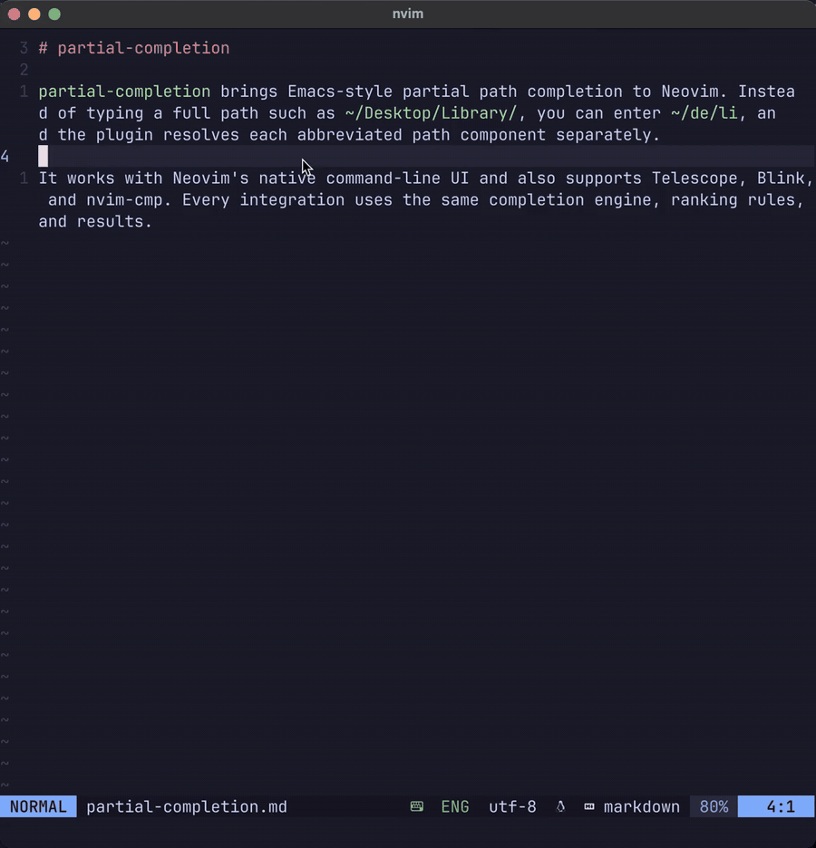

# partial-completion.nvim

`partial-completion` brings Emacs's partial-completion workflow to Neovim 0.12+
through an independent Lua implementation. It expands abbreviated path
components separately, so a path such as `~/de/li` can resolve to
`~/Desktop/Library/` without recursively indexing the whole home directory.

```text
~/de/li  -> ~/Desktop/Library/
~/de/    -> immediate children of every matching parent
```

The same deterministic matcher handles Ex commands, options, buffers, help
tags, functions, variables, mappings, and custom completion lists. The core is
UI-independent and has no mandatory Telescope, Blink, nvim-cmp, native binary,
or shell-command dependency.

> [!IMPORTANT]
> The plugin is pre-release. The runtime and its native, Telescope, Blink, and
> nvim-cmp integrations are implemented and tested, but the license, release
> version, and final adapter support matrix have not yet been selected.

## Demo



## Why partial completion?

Most fuzzy pickers begin with an already discovered candidate set. That does
not help when an intermediate directory does not literally exist:

```text
Typed path:      ~/de/li
Literal parent:  ~/de        (does not exist)
Existing path:   ~/Desktop/Library/
```

`partial-completion` walks the path from left to right:

1. Scan `~/` and match `de` against immediate children.
2. Keep matching directories such as `Desktop` and `Developer`.
3. Scan only those directories and match `li`.
4. Return existing entries while preserving the typed `~/` spelling.

The provider does not recursively enumerate unrelated descendants. Work,
branches, results, caches, and scan chunks are bounded; newer input cancels and
silences older asynchronous requests.

## Requirements

- Neovim 0.12 or newer.
- macOS or Linux for the complete currently qualified runtime and adapter
  matrix.
- Windows path semantics have a native drive-backed core smoke, but the final
  Windows adapter/release matrix is still pending.
- Telescope, Blink, and nvim-cmp are optional and loaded only when their
  integrations are configured.

The pinned integration gate currently exercises Telescope v0.2.2, Blink
v1.10.2, and nvim-cmp v0.0.2.

## Installation

With lazy.nvim:

```lua
{
  "Prgebish/partial-completion.nvim",
  config = function()
    require("partial_completion").setup({
      native = { enabled = true },
    })
  end,
}
```

Without a plugin manager, clone the repository into a native package directory:

```sh
git clone https://github.com/Prgebish/partial-completion.nvim \
  ~/.local/share/nvim/site/pack/plugins/start/partial-completion.nvim
```

Then call `require("partial_completion").setup(...)` from `init.lua`.

## Quick start: native command-line UI

The first-party UI is the shortest path to the defining feature:

```lua
require("partial_completion").setup({
  native = { enabled = true },
})
```

Now enter an Ex command such as:

```vim
:edit ~/de/li
:set wildm
:help api-
```

While the menu is visible, the default keys are:

| Key | Action |
|---|---|
| `<Tab>` | Select the next item |
| `<S-Tab>` | Select the previous item |
| `<C-y>` | Accept the selected item |
| `<C-e>` | Cancel completion |

These are the adapter's tested defaults, installed only while its menu is
visible. Some terminal configurations do not send `<S-Tab>` as a distinct key;
if yours does not, remap `previous` to another key. Every binding is
configurable and can be disabled with `false`.

`<CR>` keeps its normal Neovim meaning and executes the command line. Existing
command-line mappings are restored exactly when the menu closes. Macro
playback bypasses the adapter mappings, and entering the command-line window
with `<C-f>` cancels and hides completion.

The native adapter is disabled by default. It can also be controlled at
runtime:

```vim
:PartialCompletionEnable
:PartialCompletionDisable
:PartialCompletionToggle
```

Choose one command-line presentation at a time. If Blink or nvim-cmp owns your
command-line menu, leave `native.enabled = false` and configure the matching
adapter instead.

## Matching behavior

Matching depends on the completion category:

| Input | Candidate | Behavior |
|---|---|---|
| `de/li` | `Desktop/Library/` | Every `/`-separated component must match |
| `te-fi-fi` | `TelescopeFindFiles` | Symbol punctuation and CamelCase boundaries match |
| `tff` | `TelescopeFindFiles` | Compact symbol initials match in the default style |
| `alBe` | `alphaBeta` in a generic list | Does not match implicitly |

Ranking is deterministic. Every item carries insertion text, display text,
score, match level, and UTF-8-safe highlight spans, so adapters do not need to
reimplement matching.

### Paths

- Path matching is case-insensitive by default, even on a case-sensitive
  filesystem.
- `/`, `~/`, `./`, `../`, `$NAME/`, and `${NAME}/` roots keep their typed form
  when inserted.
- Intermediate components must resolve to directories.
- Results are real filesystem entries; a missing final component is never
  invented. You can still press `<CR>` on raw `:edit path/to/new-file` input to
  create a buffer normally.
- A trailing separator lists one immediate child level beneath every matching
  parent.
- Hidden entries use the `matching` policy by default: type `.` at the start of
  a component to include dotfiles.
- Spaces, `[]`, `?`, and other filename characters are literal in the default
  matching style.
- `./` and `../` are accepted when typed explicitly but are never generated as
  menu candidates.

Ambiguous parents remain ambiguous:

```text
Filesystem:
  ~/Desktop/Library/
  ~/Developer/lib/

Input: ~/de/li
Results:
  ~/Desktop/Library/
  ~/Developer/lib/
```

### Matching styles

The default `extended` style adds Neovim-oriented punctuation, CamelCase, and
compact-initial matching. An independently implemented `emacs` style follows
the frozen GNU Emacs 31.1 black-box partial-completion grammar for wildcards,
repeated delimiters, explicit `.`/`..` traversal, and cycling order:

```lua
require("partial_completion").setup({
  matching_style = "emacs",
  native = { enabled = true },
})
```

```text
extended: tff    matches TelescopeFindFiles
emacs:    tff    does not match TelescopeFindFiles
emacs:    de*li  matches debug-list
emacs:    de--li requires an additional real word boundary
```

The compatibility claim covers matching and cycling behavior only. The plugin
intentionally never adds Emacs's visible `./` and `../` navigation candidates.

## Telescope

Load the extension after Telescope:

```lua
require("telescope").setup({
  extensions = {
    partial_completion = {
      files = {
        prompt_title = "Partial Completion Files",
      },
      commands = {
        prompt_title = "Partial Completion Commands",
      },
    },
  },
})

require("telescope").load_extension("partial_completion")
```

Open either picker directly or map it:

```lua
local extension = require("telescope").extensions.partial_completion

vim.keymap.set("n", "<leader>pf", function()
  extension.files({ cwd = vim.uv.cwd() })
end, { desc = "Partial-completion files" })

vim.keymap.set("n", "<leader>pc", function()
  extension.commands()
end, { desc = "Partial-completion commands" })
```

The files picker uses the incremental filesystem provider and Telescope's file
previewer. The commands picker opens an Ex line containing the selected command
without executing it. Picker options may include ordinary Telescope options
plus:

- `request`: core request overrides such as `limit`, `case_mode`,
  `matching_style`, or `allow_subsequence`;
- `request_builder(prompt, kind)`: complete custom request construction;
- `command_suffix = false`: omit the space normally added after a selected
  command;
- `on_error(message)`: custom error reporting.

## Blink

Add the provider to Blink's insert and command-line source lists:

```lua
require("blink.cmp").setup({
  sources = {
    default = {
      "lsp",
      "path",
      "snippets",
      "buffer",
      "partial_completion",
    },
    providers = {
      partial_completion = {
        name = "Partial Completion",
        module = "partial_completion.adapters.blink",
        async = true,
        opts = {
          auto_highlight = true,
          request = {
            limit = 100,
          },
        },
      },
    },
  },
  cmdline = {
    sources = { "partial_completion" },
  },
})
```

In insert mode the source completes filesystem paths. In command-line mode it
delegates category detection, escaping, and replacement ranges to Neovim's Ex
completion context. Quoted paths, escaped spaces, and completion in the middle
of a token preserve surrounding text.

Blink normally highlights only the keyword after the final `/`. When the
source is constructed, this adapter wraps Blink's active label renderer so all
core path-component spans are shown. Existing custom highlights and unrelated
sources keep their host behavior. Set `auto_highlight = false` only when you
want Blink's original highlighting.

Provider `opts` also accept:

- `cwd = "/absolute/path"` or `get_cwd = function(context) ... end`;
- `request = { ... }` for per-request matcher and limit overrides;
- `on_error = function(message) ... end`.

Blink's pre-apply hook rejects an item when its request, generation, source
text, cursor, or replacement no longer matches the latest published context.

## nvim-cmp

Register the source before adding it to nvim-cmp's source lists:

```lua
local cmp = require("cmp")
local source_id, err = require("partial_completion.adapters.nvim_cmp").register()

if source_id == nil then
  vim.notify(err, vim.log.levels.WARN)
end

cmp.setup({
  sources = cmp.config.sources({
    { name = "nvim_lsp" },
    { name = "partial_completion" },
  }, {
    { name = "buffer" },
  }),
})

cmp.setup.cmdline(":", {
  mapping = cmp.mapping.preset.cmdline(),
  sources = {
    { name = "partial_completion" },
  },
})
```

`register()` installs the core-order comparator before nvim-cmp's default
comparators and owns cancellation on `InsertLeave`, `CmdlineLeave`,
`CmdwinEnter`, and source unregistration. It accepts the same `cwd`, `get_cwd`,
`request`, and `on_error` options as the Blink source; `name` can override the
registered source name.

nvim-cmp v0.0.2 applies an item's text edit before it calls the source's
`execute` hook. The adapter can diagnose an unrelated post-edit context but
cannot prevent an already applied stale edit through that host API. Native,
Telescope, and Blink retain strict pre-apply guards. nvim-cmp also owns its
visible fuzzy highlights; core spans remain available in item metadata.

## Configuration

Defaults are intentionally usable without tuning. This expanded setup shows
every configuration group and its default values:

```lua
require("partial_completion").setup({
  limit = 100,
  max_limit = 1000,
  matching_style = "extended",

  categories = {
    -- path = {
    --   profile = "path",
    --   case_mode = "insensitive",
    --   matching_style = "extended",
    -- },
  },

  filesystem = {
    branch_limit = 64,
    max_results = 1000,
    max_entries_scanned = 50000,
    scan_chunk_size = 256,
    emit_chunk_size = 32,
    hidden = "matching",
    -- case_sensitive = nil,
    cache = {
      max_entries = 128,
      max_bytes = 4 * 1024 * 1024,
      ttl_ms = 1000,
    },
  },

  native = {
    enabled = false,
    max_items = 10,
    min_width = 20,
    max_width = 80,
    mappings = {
      next = "<Tab>",
      previous = "<S-Tab>",
      accept = "<C-y>",
      cancel = "<C-e>",
    },
    request = {},
  },

  debug = {
    enabled = false,
    sensitive = false,
    max_entries = 200,
    -- sink = function(record) end,
  },
})
```

Unknown configuration keys are rejected instead of silently falling back to a
default.

### Top-level and category options

| Option | Default | Meaning |
|---|---:|---|
| `limit` | `100` | Default maximum items in an engine update |
| `max_limit` | `1000` | Safety cap for request-specific limits |
| `matching_style` | `"extended"` | Global `extended` or `emacs` grammar |
| `categories[name].profile` | category default | Override with `path`, `symbol`, or `generic` |
| `categories[name].case_mode` | category default | `insensitive`, `sensitive`, `smart`, or `filesystem` |
| `categories[name].matching_style` | global style | Override the matching style for one category |

The built-in categories are `path`, `command`, `option`, `buffer`, `help`,
`function`, `variable`, `mapping`, and `generic`. `path` defaults to
`insensitive`; all other built-in categories default to `smart`, where an
uppercase query makes matching case-sensitive.

Loose subsequence matching is disabled by default. Enable it as the
lowest-ranked fallback for native command-line requests:

```lua
require("partial_completion").setup({
  native = {
    enabled = true,
    request = {
      allow_subsequence = true,
    },
  },
})
```

### Filesystem options

| Option | Default | Meaning |
|---|---:|---|
| `branch_limit` | `64` | Maximum matching intermediate branches advanced |
| `max_results` | `1000` | Provider-side result ceiling |
| `max_entries_scanned` | `50000` | Maximum directory entries examined per request |
| `scan_chunk_size` | `256` | Entries drained before yielding to the event loop |
| `emit_chunk_size` | `32` | Provider emission batch size |
| `hidden` | `"matching"` | `matching`, `always`, or `never` dotfile policy |
| `case_sensitive` | detected fallback | Override only filesystem-derived case probing |
| `cache.max_entries` | `128` | Maximum cached directory listings |
| `cache.max_bytes` | `4194304` | Approximate cache byte limit |
| `cache.ttl_ms` | `1000` | Cache lifetime; `0` disables reuse by expiry |

To make path matching itself case-sensitive, configure the path category:

```lua
require("partial_completion").setup({
  categories = {
    path = { case_mode = "sensitive" },
  },
})
```

Use `case_mode = "filesystem"` only when matching should follow the behavior
probed for each scanned directory. `filesystem.case_sensitive` supplies an
explicit fallback for that mode; it does not change the default path policy.

### Native options

| Option | Default | Meaning |
|---|---:|---|
| `enabled` | `false` | Start the first-party command-line UI during `setup()` |
| `max_items` | `10` | Maximum visible items in the one-line menu |
| `min_width` | `20` | Minimum floating-menu width |
| `max_width` | `80` | Maximum floating-menu width |
| `mappings.*` | table above | Menu-only keys; use `false` to disable one |
| `request` | `{}` | Overrides applied to each native engine request |

Native request overrides accept `allow_subsequence`, `case_mode`, `limit`, and
`matching_style`. Advanced embedding and portability tests may also supply an
absolute `cwd`/`home`, `env`, `filesystem_case_sensitive`, `platform`, or a
dense `search_roots` list.

## Diagnostics and troubleshooting

Run:

```vim
:checkhealth partial_completion
```

It checks the Neovim version, active or last rejected configuration, native
adapter state, and optional host availability without loading those hosts.

Common issues:

- **No menu appears:** the core does not provide a UI by itself. Enable the
  native adapter or configure exactly one of the supported host adapters.
- **No suggestion for a new filename:** completion advertises existing entries
  only. Keep the raw `:edit` text and press `<CR>` to create the buffer.
- **Dotfiles are missing:** with `hidden = "matching"`, begin that path
  component with `.`.
- **Results are truncated:** raise `limit`, `filesystem.max_results`,
  `filesystem.branch_limit`, or `filesystem.max_entries_scanned` carefully.
  Large limits increase I/O, ranking work, and memory.
- **Native keys conflict:** change a key under `native.mappings` or set it to
  `false`. The adapter installs mappings only while its menu is visible.
- **Two command-line menus appear:** disable the native adapter when Blink or
  nvim-cmp presents command-line results.
- **A network mount remains busy after cancellation:** callback delivery stops
  immediately and libuv cancellation is attempted, but an OS filesystem call
  already blocked inside the mount may not be portable to abort.

For bounded structured diagnostics:

```lua
require("partial_completion").setup({
  debug = {
    enabled = true,
    max_entries = 200,
    sensitive = false,
    sink = function(record)
      -- Optional; sink failures cannot fail a completion request.
    end,
  },
})

local completion = require("partial_completion")
local records = completion.debug_records()
completion.clear_debug_records()
```

Queries, source text, working directories, roots, paths, labels, insertion
text, and messages are redacted unless `debug.sensitive = true`. Sensitive
logging may expose private filenames or typed content; enable it only for a
short, controlled debugging session.

## Public API

API version 1 exposes provider registration, streaming completion, synchronous
cancellation, command-line context helpers, and selection-bearing sessions:

```lua
local completion = require("partial_completion")

local handle = completion.complete({
  api_version = 1,
  category = "path",
  query = "~/de/li",
  provider = "filesystem",
  cwd = vim.uv.cwd(),
}, function(update)
  -- update.items is a complete, deterministically sorted snapshot.
  if update.done then
    vim.print(update.items)
  end
end)

handle:cancel()
```

Updates from ordinary provider chunks are merged into complete snapshots.
Providers may emit replacement snapshots for bounded provisional top-K
discovery. Public byte ranges are zero-based, half-open UTF-8 offsets. The same
API also exposes custom provider registration, command-line context helpers,
and selection-bearing sessions.

## Limitations

- Neovim 0.11 and older are unsupported.
- Remote URIs and virtual filesystems such as `oil://` are not built-in
  filesystem roots; they require a custom provider.
- mini.pick, Snacks, fzf-lua, and wilder adapters are not implemented.
- Network filesystems cannot be given a portable deadline for a kernel call
  that is already blocked.
- Windows core path behavior is tested, but Windows UI adapters are not yet a
  release support claim.
- nvim-cmp v0.0.2 cannot reject a stale item before its host applies the edit.
- No project license has been selected yet.

## Development and verification

The canonical gate is:

```sh
make verify
```

It covers documentation and contract validation, formatting, linting,
unit/property/contract tests, isolated Neovim startup and integration,
real-dependency adapter API and PTY UI smokes, portability contracts, and
matcher/filesystem regression benchmarks.

If `partial-completion` improves your workflow, please star the repository. It
helps other Neovim users discover the plugin.
